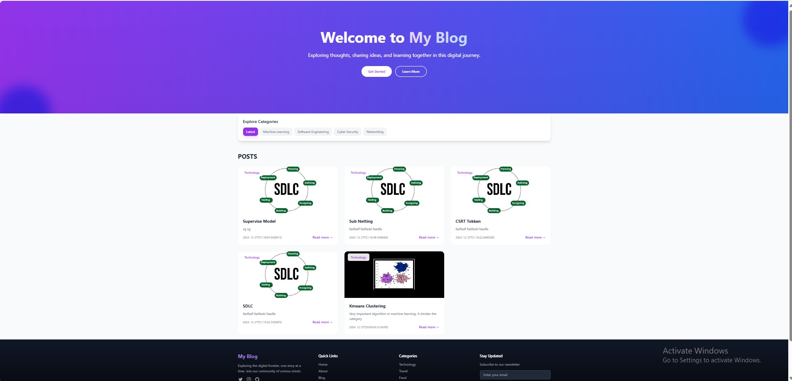
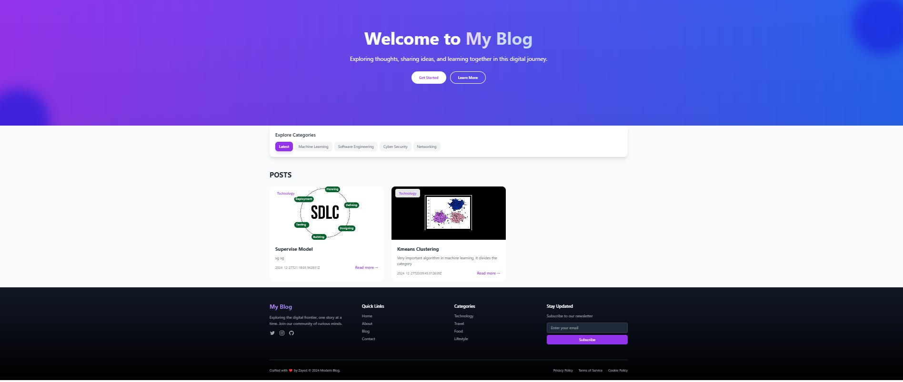
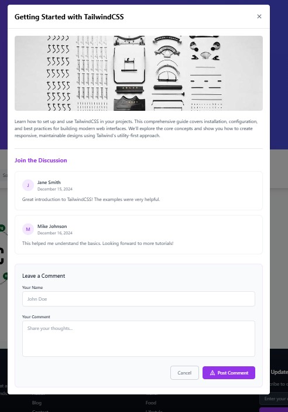
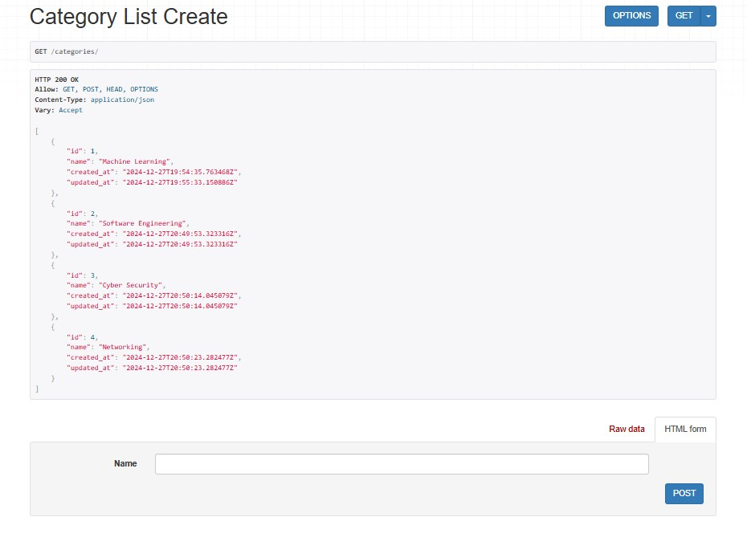
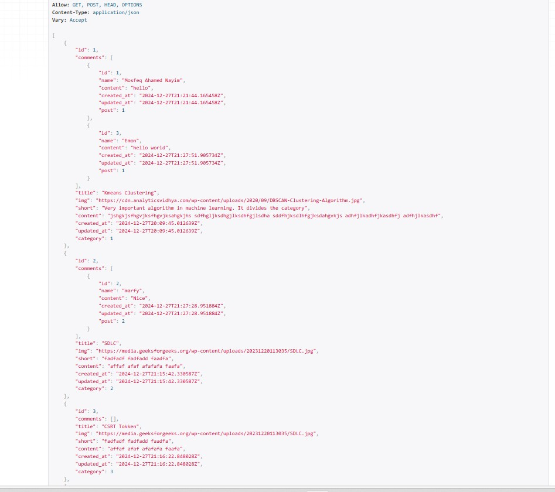
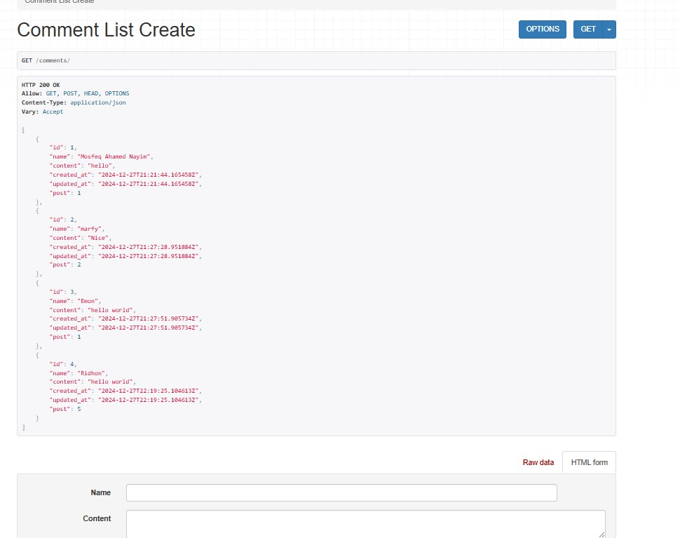

# Blog API with Frontend


This project provides a Blog API with backend functionality to manage categories, posts, and comments, built using Django and Django REST Framework. It also includes frontend functionality (you can integrate this with a React or similar frontend) for users to view and interact with the blog data. The API supports CRUD operations for blog posts, categories, and comments, with user-friendly endpoints.

## Features

- **Category Management:** Create, list, update, and delete categories for blog posts.
- **Post Management:** List, create, update, delete, and filter blog posts by category.
- **Comment Management:** AAdd, update, delete, and list comments on blog posts.
- **Latest Posts:** Retrieve the six most recent blog posts.


## Tech Stack
- **Backend:** Django 5.1.4, Django REST Framework
- **Frontend:** HTML, CSS, Javascript
- **Database:** SQLite3

## Tech Stack
-  **Categories** 
- GET /categories/: List all categories.
- POST /categories/: Create a new category.
- GET /categories/<int:id>/: Retrieve a category by ID.
- PUT /categories/<int:id>/: Update a category.
- DELETE /categories/<int:id>/: Delete a category.

-  **Posts** 
- GET /posts/: List all posts.
- POST /posts/: Create a new post.
- GET /posts/<int:id>/: Retrieve a post by ID.
- PUT /posts/<int:id>/: Update a post.
- DELETE /posts/<int:id>/: Delete a post.
- GET /posts/last-six/: Fetch the last 6 posts.

-  **Comments** 
- GET /comments/: List all comments.
- POST /comments/: Create a new comment.
- GET /comments/<int:id>/: Retrieve a comment by ID.
- PUT /comments/<int:id>/: Update a comment.
- DELETE /comments/<int:id>/: Delete a comment.

## Setup Instructions

1. Clone the repository:
   ```bash
   git clone https://github.com/your-username/your-repo-name.git
   cd your-repo-name
   
2.Create a virtual environment:
python -m venv env
source env/bin/activate  # On Windows, use `env\Scripts\activate`

3.Install dependencies:
pip install -r requirements.txt

4.Set up the database:
python manage.py migrate

5.Create a superuser to access the admin panel:
python manage.py createsuperuser

6.Run the development server:
python manage.py runserver

7.Access the application at http://127.0.0.1:8000/.

8.Go to simple-blog-starter and run index.html for frontend

9.Access the application at http://127.0.0.1:5500/simple-blog-starter/index.html
